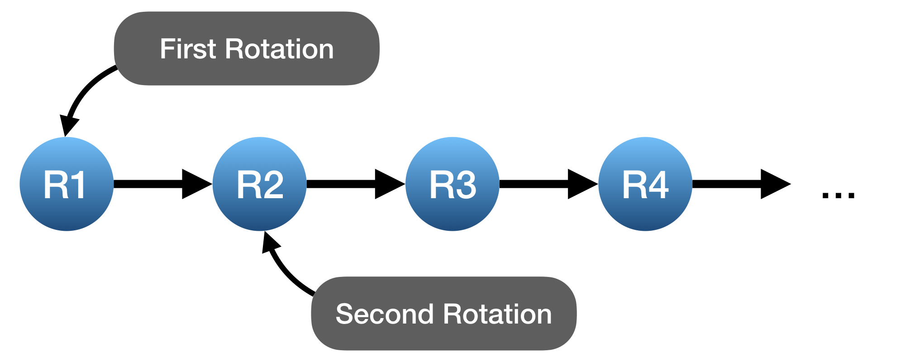

Composing rotations
===================

```@meta
CurrentModule = ReferenceFrameRotations
DocTestSetup = quote
    using ReferenceFrameRotations
end
```

Multiple rotations represented can be composed using the function:

```julia
compose_rotation(R1,R2,R3,R4...)
```

in which `R1`, `R2`, `R3`, ..., must be of the same type. This method returns
the following rotation:



Currently, this method supports DCMs, Euler angle and axis, Euler angles, and
Quaternions.

```jldoctest
julia> D1 = angle_to_dcm(0.5,0.5,0.5,:XYZ)
3×3 StaticArrays.SArray{Tuple{3,3},Float64,2,9} with indices SOneTo(3)×SOneTo(3):
  0.770151   0.622447  -0.139381
 -0.420735   0.659956   0.622447
  0.479426  -0.420735   0.770151

julia> D2 = angle_to_dcm(-0.5,-0.5,-0.5,:ZYX)
3×3 StaticArrays.SArray{Tuple{3,3},Float64,2,9} with indices SOneTo(3)×SOneTo(3):
  0.770151  -0.420735   0.479426
  0.622447   0.659956  -0.420735
 -0.139381   0.622447   0.770151

julia> compose_rotation(D1,D2)
3×3 StaticArrays.SArray{Tuple{3,3},Float64,2,9} with indices SOneTo(3)×SOneTo(3):
 1.0          2.77556e-17  0.0
 2.77556e-17  1.0          5.55112e-17
 0.0          5.55112e-17  1.0

julia> ea1 = EulerAngleAxis(30*pi/180, [0;1;0]);

julia> ea2 = EulerAngleAxis(45*pi/180, [0;1;0]);

julia> compose_rotation(ea1,ea2)
EulerAngleAxis{Float64}:
  Euler angle:   1.3090 rad ( 75.0000 deg)
   Euler axis: [  0.0000,   1.0000,   0.0000]

julia> Θ1 = EulerAngles(1,2,3,:ZYX);

julia> Θ2 = EulerAngles(-3,-2,-1,:XYZ);

julia> compose_rotation(Θ1, Θ2)
EulerAngles{Float64}:
  R(X):  -0.0000 rad (  -0.0000 deg)
  R(Y):   0.0000 rad (   0.0000 deg)
  R(Z):  -0.0000 rad (  -0.0000 deg)

julia> q1 = angle_to_quat(0.5,0.5,0.5,:XYZ);

julia> q2 = angle_to_quat(-0.5,-0.5,-0.5,:ZYX);

julia> compose_rotation(q1,q2)
Quaternion{Float64}:
  + 0.9999999999999998 + 0.0.i + 0.0.j + 0.0.k
```
